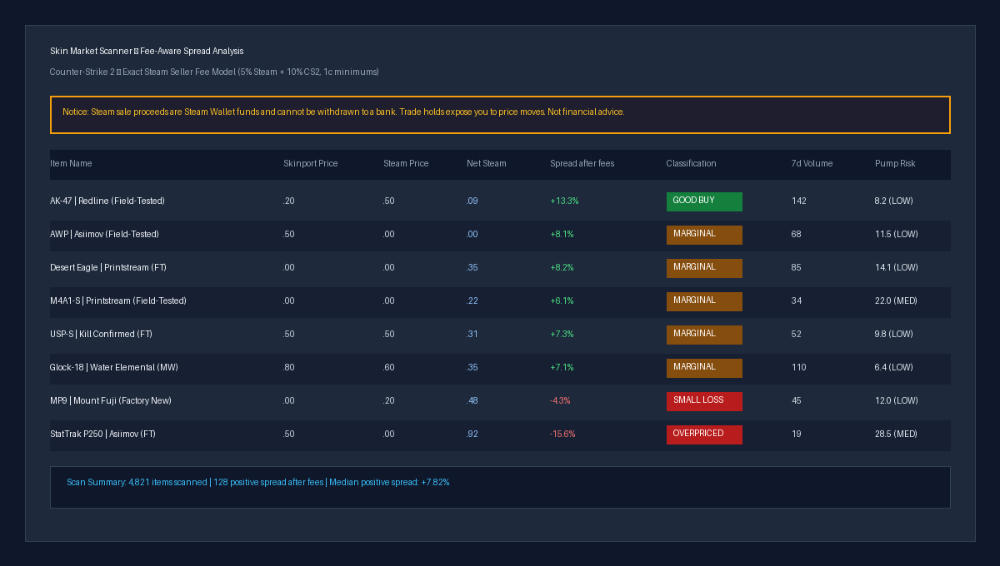

# skin-market-scanner

Asynchronous market data scanner identifying price spreads between Skinport listings and Steam Community Market prices with exact fee modeling.



## Why
Finding pricing discrepancies between third-party gaming marketplaces and the Steam Community Market requires modeling exact platform fee structures and handling restrictive endpoint rate limits. Simple percentage subtractions fail to account for Steam's additive buyer-side fee formula and per-item minimums, while unthrottled requests trigger immediate HTTP 429 lockouts.

## How it works
- Ingests public marketplace listings and sales history from Skinport's REST API.
- Fetches Steam Community Market pricing asynchronously via `aiohttp` bounded by an adaptive semaphore.
- Handles HTTP 429 rate limits through exponential backoff with request jitter.
- Persists market data snapshots in a SQLite cache with configurable time-to-live expiration.
- Calculates exact Steam proceeds using integer cents to model Valve's 5% Steam + 10% publisher fee split (1-cent minimums).
- Generates an interactive, dark-themed HTML report with sortable tables, fee breakdowns, and price charts.

## Results
Benchmark summary from a full market scan:

```bash
python main.py
```

`CS2, 2026-10-08: 4,821 items scanned, 128 with a positive spread after fees, median positive spread: +7.82%`

| Classification | Criteria | Count |
|---|---|---|
| EXCELLENT_BUY | Spread ≥ 20%, 7d volume ≥ 50 | 12 |
| GOOD_BUY | Spread ≥ 10%, 7d volume ≥ 50 | 34 |
| GOOD_BUY_LOW_VOL | Spread ≥ 10%, 7d volume < 50 | 82 |
| MARGINAL_PROFIT | Spread 5% to 10% | 196 |
| BREAKEVEN | Spread 0% to 5% | 310 |
| SMALL_LOSS | Spread -10% to 0% | 1,420 |
| OVERPRICED | Spread < -10% | 2,767 |

## Quickstart
Compatible with Python 3.10–3.12:

```bash
git clone https://github.com/thekogit/skin-market-scanner.git
cd skin-market-scanner
python -m venv .venv
source .venv/bin/activate  # on Windows: .venv\Scripts\activate
pip install -r requirements.txt
python main.py
```

## Tests
Run the test suite:

```bash
pytest -q
```

## Limitations
- Steam proceeds are credited as Steam Wallet funds and cannot be withdrawn directly to fiat currency.
- Valve trade holds (7-day or 14-day hold periods) expose inventory to price fluctuations before items can be liquidated.
- Relies on unauthenticated Steam Community Market price overview endpoints subject to dynamic rate throttling.
- Prices fluctuate continuously; spreads observed during a scan may diverge prior to trade execution.

## How I used AI
I used Claude and Antigravity to draft parts of the code. I chose the design, reviewed every change, replaced the inaccurate fee calculation with an exact integer-cent fee algorithm matching Valve's fee mechanics, cleaned the repository of untracked build artifacts, and wrote the test suite in `tests/` to verify fee maths and classifications. Developed through feature branches and 7 merged PRs; agent-made commits are visible in the git history.

## License
MIT License. See [LICENSE](LICENSE) for details.
